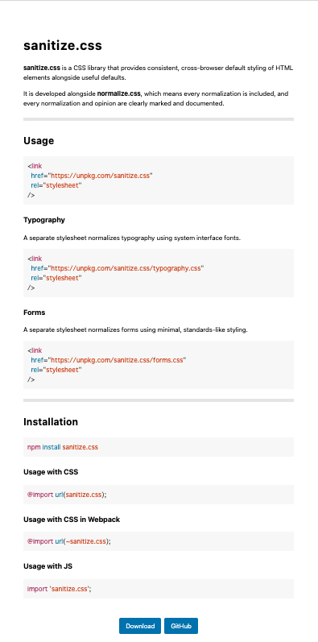
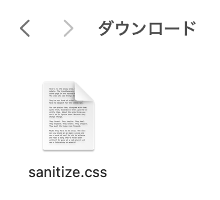

<!DOCTYPE html>
<html lang="ja">
<head>
    <meta charset="UTF-8">
    <meta name="viewport" content="width=device-width, initial-scale=1.0">
    <link rel="stylesheet" href="style.css">
    <title>33.リセットcss</title>
</head>
<body>
    <h1>リセットcssについて、学習していきましょう！</h1>
    <h2>リセットcssとは？</h2>
    
    <p>htmlでコードを書いていく時、元々paddingやmarginなどが最初から設定されている箇所があります。<br>
    その設定をリセットしてくれるファイルのことをリセットcssと言います。</p>
    <p>リセットするためには、cssが書かれている特定のファイルを読み込ませる必要があります。<br>
    ファイルを読み込ませるだけでリセットしてくれるので、とても便利です。</p>
   <p>リセットすることで、どのブラウザでも同じような表示がされるようになるので、<br> 「このパソコンで見たときは〇〇のように見えるのに、
    他のパソコンで見たら違って見える！」ということがなくなります。</p> 
    <p>サイトを作る際に、「パソコンやブラウザによって見え方が違う」ということが起こってはいけないので<br>
    （見え方が違うと困惑したり問題に繋がる可能性があります）リセットcssを最初に読み込ませる必要があります。</p>
    <hr>
    <h2>リセットcssについて</h2>
    <p>リセットcssには、たくさん種類がありそれぞれのファイルごとに特徴があります。</p>
    <p>例えば、リストの黒点を最初から消してくれていたり、すべての要素に「background-repeat: no-repeat; 」（画像を繰り返し表示させないという命令）<br>
         を適用してくれていたりと、一つ一つのファイルによってリセットされる内容が異なります。</p>
    <hr>
    <h2>おすすめのリセットcss</h2>
    <p>最低限のスタイルを与えつつ、不必要な箇所をリセットしてくれる「sanitize.css」が使いやすいのでおすすめです。<br>
    今回はこのリセットcssを読み込んでいきます。</p>
    <hr>
    <h2>sanitize.cssの読み込ませ方</h2>
    <p>リセットcssはGoogleなどで検索し、そこから引っ張ってきて読み込みを行います。<br>
    無料で公開されており、誰でも使用することが出来ます。</p>
    <p>①Googleで「sanitize.css」と検索すると一番上に出てきますが、今回はこちらのリンクから飛んでください。<br>
    <a href="https://csstools.github.io/sanitize.css/" target="_blank">「sanitize.css」</a></p>
    <hr>
    <p>②動画のように、下までスクロールしてDownloadをクリックしてください。</p>
    <video src="move.mp4" controls width="600px"></video>
    <hr>
    <p>③写真のようなファイルがダウンロードされているので、現在作っているhtmlとcssと同じフォルダに入れます。</p>
    
    <hr>
    <p>④最後に、このファイルを読み込むためのコードをhtmlファイルに書いていきます(6行目)<br>
    書き方は、いつもcssを読み込ませるために書く方法と全く同じです。</p>

``` html
<!DOCTYPE html>
<html lang="ja">
<head>
    <meta charset="UTF-8">
    <meta name="viewport" content="width=device-width, initial-scale=1.0">
    <link rel="stylesheet" href="sanitize.css">
    <link rel="stylesheet" href="style.css">
    <title>リセットcss</title>
</head>
```
<p>気を付ける点として、後に書いたcssの方が優先されるので、style.cssよりも前に書かないといけません。<br>
    （リセットcssはあくまでリセットをする、最初の土台を作るcssでありメインではないため後に来ないといけません）</p>
    <p>これでリセットcssの読み込みは完了です！ </p>
    <h2>リセットcssを読み込む前と読み込んだ後でどこが違うか、ブラウザで確認してみよう！</h2>

<br>
<h1>解説動画</h1>
<iframe width="1000" height="600" src="https://www.youtube.com/embed/_amTSLuYrHE?si=wCsm7Kjk38ECVZ6-" title="YouTube video player" frameborder="0" allow="accelerometer; autoplay; clipboard-write; encrypted-media; gyroscope; picture-in-picture; web-share" referrerpolicy="strict-origin-when-cross-origin" allowfullscreen></iframe>

</body>
</html>