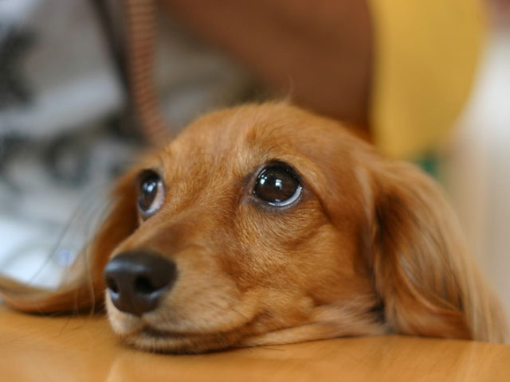

**```php```**

<!DOCTYPE html>
<html lang="en">
<head>
    <meta charset="UTF-8">
    <meta http-equiv="X-UA-Compatible" content="IE=edge">
    <meta name="viewport" content="width=device-width, initial-scale=1.0">
    <link rel="stylesheet" href="style.css">
    <title>カリキュラム26宿題</title>
</head>
<body>
    <h1>確認問題.以下と同じものを作り、レスポンシブ対応もさせよう！</h1>
    <h3>仕様</h3>
    <ul>
        <li>画像は何でもOK</li>
        <li>画像の横幅は30%に設定</li>
        <li>全体の横幅は50%に設定</li>
        <li>フォントサイズは1vwに設定</li>
        <li>要素をボーダーで囲む</li>
        <li>要素全体を画面の中央に持ってくる</li>
        <li>画面サイズが960px以下になったら、画像とテキストが縦並びになる</li>
        <li>画面サイズが960px以下になったら、フォントサイズを2vwにする</li>
        <li>画面サイズが960px以下になったら、画像の横幅を80％に変更</li>
        <li>画面サイズが480px以下になったら、フォントサイズを3vwにする</li>
    </ul>
    <br>
    <div class="box">
        <div class="dog_box">
            
            <p>テキストテキストテキストテキストテキスト<br>
                テキストテキストテキストテキストテキスト<br>
                テキストテキストテキストテキストテキスト</p>
        </div>
    </div>
    <div class="box">
        <div class="dog_box">
            
            <p>テキストテキストテキストテキストテキスト<br>
                テキストテキストテキストテキストテキスト<br>
                テキストテキストテキストテキストテキスト</p>
        </div>
    </div>
      <!-- 折り畳み展開ポインタ -->
<div onclick="obj=document.getElementById('open').style; obj.display=(obj.display=='none')?'block':'none';">
    <a style="cursor:pointer;">▼ 解答はこちらをクリックすると見れます</a>
    </div>
    <!--// 折り畳み展開ポインタ -->
    <!-- 折り畳まれ部分 -->
    <div id="open" style="display:none;clear:both;">
    <!--ここの部分が折りたたまれる＆展開される部分になります。
    自由に記述してください。-->

 ``` html
 <!-- HTML -->
<div class="box">
    <div class="dog-box">
        
        <p>テキストテキストテキストテキストテキスト<br>
           テキストテキストテキストテキストテキスト<br>
           テキストテキストテキストテキストテキスト</p>
    </div>
</div>

<div class="box">
    <div class="dog-box">
        
        <p>テキストテキストテキストテキストテキスト<br>
           テキストテキストテキストテキストテキスト<br>
           テキストテキストテキストテキストテキスト</p>
    </div>
</div>
```

``` css
 /* CSS */
.box{
    width: 50%;
    margin: 0 auto;
    border: 1px solid black;
}

.dog_box{
    display: flex;
    justify-content: space-around;
}

.dog_box p{
    margin: auto 0;
    font-size: 1vw;
}

.dog_box img{
    width: 30%;
    padding: 10px 0;
}
```
``` css
 /* CSS */
@media screen and (max-width: 960px) { 
    /* 画面サイズ 960px以下に適用 */
    .dog_box {
        flex-direction: column;
        align-items: center;
      }

      .dog_box p{
        font-size: 2vw;
        margin-top: 10px;
    }

    .dog_box img{
        width: 80%;
    }
}

```
``` css
 /* CSS */
@media screen and (max-width: 480px) { 
    /* 画面サイズ 480px以下に適用 */
      .dog_box p{
        font-size: 3vw;
    }
}
```
</div>
    <!--// 折り畳まれ部分 -->


<h1>解説動画</h1>
<iframe width="1000" height="600" src="https://www.youtube.com/embed/jgDt_ecnWJ8?si=NM0uU8on_XTzcIRf" title="YouTube video player" frameborder="0" allow="accelerometer; autoplay; clipboard-write; encrypted-media; gyroscope; picture-in-picture; web-share" referrerpolicy="strict-origin-when-cross-origin" allowfullscreen></iframe>
    

</body>
</html>